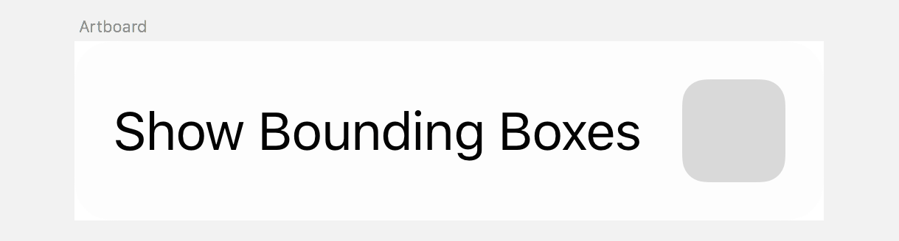

Sketch plugin that shows bounding boxes of all layers aka Show layer edges/rectangles/frames

## Install

Via [Sketch Runner](http://sketchrunner.com) or [Sketchpacks](https://sketchpacks.com/pravdomil/Sketch-Show-Bounding-Boxes) or [manually](../../releases).

## Backers

[Interface.Market](https://interface.market).

## Donate

[Buy a beer](https://www.paypal.com/cgi-bin/webscr?cmd=_s-xclick&hosted_button_id=BCL2X3AFQBAP2&item_name=Sketch%20Show%20Bounding%20Boxes%20Beer).
